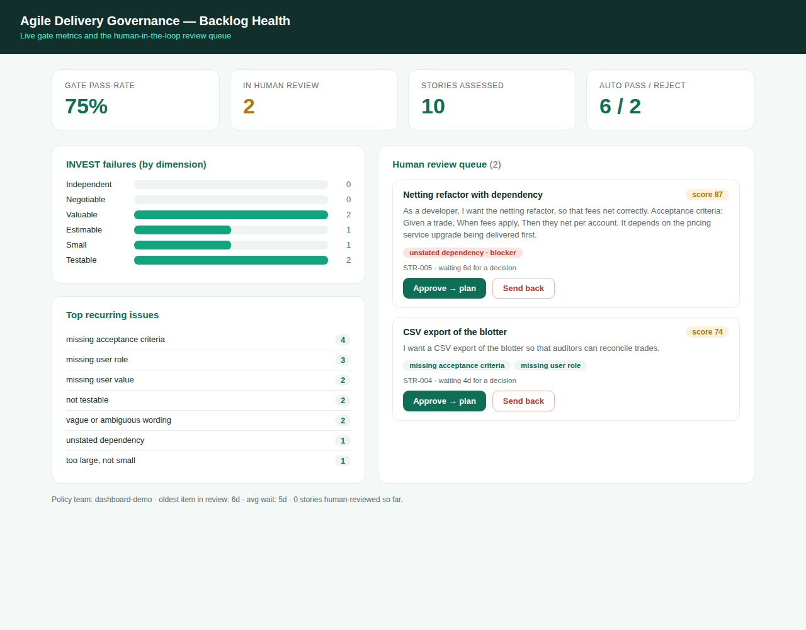

# Backlog-health dashboard + human-in-the-loop review

A web dashboard that turns the per-story gate into a **backlog-health instrument**, and
puts a **human in the loop** for the stories the gate can't auto-decide.



## What it shows

- **Gate pass-rate** and the auto pass / review / reject split.
- **INVEST failures by dimension** — which quality dimension fails most often (so coaching
  can target it).
- **Top recurring issues** across the backlog.
- **Human review queue** — borderline stories (`gate_status == "review"`) with their score,
  issues, any hard blocker, and how long they've waited. A reviewer clicks **Approve → plan**
  or **Send back**.
- **Story ageing** — the oldest and average wait time in the review queue.

## Human-in-the-loop, end to end

1. A story is assessed. If its score lands in the team's `review_band`, or it trips a
   `hard_blocker` (e.g. an unstated dependency), it is routed to **review** instead of being
   auto-decided.
2. It appears in the **review queue**. A human approves or sends it back.
3. The decision is recorded to `data/human_decisions.jsonl` **and** appended to
   `data/feedback_labels.jsonl` as a new ground-truth example — so the next evaluation round
   learns from exactly the cases the gate found hard. That is the loop closing.

This is what the reviewer's feedback asked for: borderline scores get a human, and the
system becomes a backlog-health view rather than a one-shot workflow.

## Run

```bash
pip install -r requirements.txt        # includes fastapi + uvicorn
./dashboard/run.sh                      # seeds the demo backlog, then serves the app
# open http://127.0.0.1:8000
```

Or step by step:

```bash
python dashboard/seed_backlog.py        # build the demo backlog from sample_backlog.json
uvicorn dashboard.app:app --reload      # serve at http://127.0.0.1:8000
```

## API

| Method | Path | Purpose |
|--------|------|---------|
| GET | `/api/metrics` | backlog-health metrics |
| GET | `/api/queue` | the human review queue |
| POST | `/api/review/{story_id}` | record a decision `{ "decision": "approved"\|"rejected" }` |
| POST | `/api/assess` | assess a new story `{ "title", "description" }` |

## Files

```
dashboard/
├─ app.py                 # FastAPI: serves the UI + the API
├─ governance_store.py    # assess, persist, decide, compute metrics
├─ seed_backlog.py        # build the demo backlog (staggered ages)
├─ sample_backlog.json    # demo stories
├─ static/index.html      # the dashboard UI (no build step, no CDN)
├─ run.sh                 # seed + serve
└─ data/                  # generated state (gitignored)
```

The review policy (which scores go to a human, which issues are hard blockers) is the
`dashboard-demo` team in [`../config/dor_policy.json`](../config/dor_policy.json).
